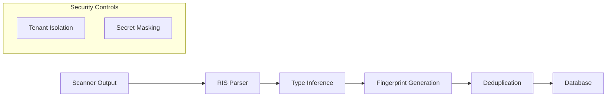

# Finding Ingestion Workflow

This guide explains how security findings flow through the Rediver platform, from scanner output to actionable insights.

---

## Overview

The finding ingestion workflow consists of 5 main phases:

```
Scanner Output → RIS Parsing → Type Inference → Fingerprinting → Persistence
```



---

## Phase 1: Scanner Output

Security scanners produce results in various formats. The platform supports:

| Format | Scanners | Description |
|--------|----------|-------------|
| SARIF 2.1.0 | Semgrep, CodeQL, Checkov | Static analysis results |
| RIS (native) | Agent | Rediver Intermediate Schema |
| JSON | Trivy, Grype | Container/dependency scans |
| Custom | Plugin scanners | Via ingestion tools |

### Example: SARIF Input

```json
{
  "$schema": "https://raw.githubusercontent.com/oasis-tcs/sarif-spec/master/Schemata/sarif-schema-2.1.0.json",
  "version": "2.1.0",
  "runs": [{
    "tool": { "driver": { "name": "semgrep" } },
    "results": [{
      "ruleId": "go.lang.security.injection.taint-sql",
      "level": "error",
      "message": { "text": "SQL injection vulnerability" },
      "locations": [{
        "physicalLocation": {
          "artifactLocation": { "uri": "src/handlers/user.go" },
          "region": { "startLine": 42 }
        }
      }],
      "codeFlows": [...]
    }]
  }]
}
```

---

## Phase 2: Type Inference

Each finding is classified into one of 5 types:

| Type | Source | Example |
|------|--------|---------|
| `vulnerability` | SAST, SCA, DAST | SQL injection, CVE-2024-1234 |
| `secret` | Secret scanners | API keys, tokens, passwords |
| `misconfiguration` | IaC scanners | S3 bucket public access |
| `compliance` | Compliance tools | CIS benchmark violations |
| `web3` | Smart contract scanners | Reentrancy, SWC-107 |

### Inference Logic

```go
// Type is inferred from source and metadata
func inferFindingType(source, metadata) FindingType {
    // 1. Explicit type in RIS takes precedence
    if metadata.Type != "" {
        return metadata.Type
    }

    // 2. Infer from source
    switch source {
    case "secret":
        return FindingTypeSecret
    case "iac":
        return FindingTypeMisconfiguration
    }

    // 3. Infer from specialized fields
    if metadata.Compliance != nil {
        return FindingTypeCompliance
    }
    if metadata.Web3 != nil {
        return FindingTypeWeb3
    }

    // 4. Default to vulnerability
    return FindingTypeVulnerability
}
```

---

## Phase 3: Fingerprint Generation

Each finding type uses a specialized fingerprinting algorithm:

| Type | Algorithm | Components | Resilience |
|------|-----------|------------|------------|
| SAST | `sast/v1` | asset + rule + file + normalized_snippet | Line shifts |
| SCA | `sca/v1` | asset + PURL + CVE | Version changes |
| DAST | `dast/v1` | asset + rule + endpoint + param | URL variations |
| Secret | `secret/v1` | asset + type + service + hash(masked) | Value changes |
| Compliance | `compliance/v1` | asset + framework + control | Control updates |
| Misconfig | `misconfig/v1` | asset + policy + resource_path | Resource changes |
| Web3 | `web3/v1` | chain + contract + SWC + function | Upgrades |

### Security: Secret Fingerprinting

The secret fingerprint strategy **never uses raw secrets**:

```go
// SECURE: Only uses hash of masked value
if masked, ok := metadata["masked_value"].(string); ok {
    maskedHash := sha256.Sum256([]byte(masked))
    h.Write(maskedHash[:8])
} else {
    // Fallback: use rule + line (no secret exposure)
    h.Write([]byte(ruleID))
    h.Write([]byte(startLine))
}
```

### Snippet Normalization (SAST)

SAST findings normalize code snippets to handle formatting changes:

```go
// Before: "if (user.input)  {\n    execute(user.input);\n}"
// After:  "if (user.input) { execute(user.input); }"
```

This makes fingerprints resilient to:
- Whitespace changes
- Line reformatting
- Minor refactoring

---

## Phase 4: Deduplication

Findings are deduplicated by fingerprint within the same asset:

```sql
-- Check for existing finding with same fingerprint
SELECT id FROM findings
WHERE asset_id = $1
  AND fingerprint = $2
  AND status NOT IN ('resolved', 'false_positive')
```

### Deduplication Outcomes

| Scenario | Action |
|----------|--------|
| New fingerprint | Create new finding |
| Existing fingerprint, same scan | Update `last_seen_at` |
| Existing fingerprint, different scan | Link to existing finding |
| Resolved finding, reappears | Reopen finding |

---

## Phase 5: Data Flow Tracking

For SAST findings with taint tracking (SARIF `codeFlows`), the platform stores the full attack path:

```
┌─────────────────────────────────────┐
│       finding_data_flows            │
├─────────────────────────────────────┤
│ id, finding_id, flow_index          │
│ message, importance                 │
└─────────────────────────────────────┘
              │
              ▼
┌─────────────────────────────────────┐
│     finding_flow_locations          │
├─────────────────────────────────────┤
│ step_index, location_type           │
│ file_path, start_line, function     │
│ snippet, message                    │
└─────────────────────────────────────┘
```

### Location Types

| Type | Description | Example |
|------|-------------|---------|
| `source` | Where tainted data enters | `username = request.form['user']` |
| `intermediate` | Transformation steps | `query = "SELECT * FROM users WHERE name='" + username` |
| `sink` | Where vulnerability occurs | `cursor.execute(query)` |
| `sanitizer` | Where data is cleaned | `username = sanitize(input)` |

---

## Security Controls

### Tenant Isolation

All queries enforce tenant boundaries:

```sql
-- REQUIRED: All queries filter by tenant_id
SELECT fl.* FROM finding_flow_locations fl
JOIN finding_data_flows df ON df.id = fl.data_flow_id
JOIN findings f ON f.id = df.finding_id
WHERE fl.file_path = $1
  AND f.tenant_id = $2  -- Mandatory
```

### Input Validation

- Location types validated at domain layer
- File paths sanitized before storage
- Snippets truncated to prevent DoS

---

## API Workflow

### 1. Ingest Findings

```bash
# Upload SARIF results
curl -X POST /api/v1/assets/{asset_id}/findings/ingest \
  -H "Authorization: Bearer $TOKEN" \
  -H "Content-Type: application/json" \
  -d @sarif-results.json
```

### 2. Query by Type

```bash
# Get all secret findings
curl /api/v1/findings?finding_type=secret&secret_valid=true

# Get compliance failures
curl /api/v1/findings?finding_type=compliance&compliance_result=fail
```

### 3. Get Data Flows

```bash
# Get attack path for a finding
curl /api/v1/findings/{finding_id}/data-flows
```

---

## Best Practices

### For Scanner Integration

1. **Use SARIF 2.1.0** when possible - richest metadata support
2. **Include codeFlows** for SAST findings - enables attack path visualization
3. **Provide masked_value** for secrets - ensures secure fingerprinting
4. **Set explicit finding_type** in RIS - avoids inference ambiguity

### For Custom Ingestion Tools

1. **Validate all inputs** at the boundary
2. **Normalize file paths** (remove `./`, resolve symlinks)
3. **Truncate large snippets** (max 2000 chars recommended)
4. **Include source metadata** for traceability

### For Querying

1. **Always filter by tenant** - enforced at API level
2. **Use specialized columns** for efficient filtering
3. **Paginate large result sets** - default limit 100
4. **Cache fingerprints** for bulk deduplication

---

## Troubleshooting

### Finding Not Deduplicated

**Cause**: Different fingerprints due to:
- Different asset IDs
- Code changes in snippet
- Scanner reporting different rule IDs

**Solution**: Check `partial_fingerprints` JSONB field to see all algorithm outputs.

### Data Flows Missing

**Cause**: Scanner didn't include `codeFlows` in SARIF output.

**Solution**: Enable taint tracking in scanner configuration:
- Semgrep: Use `--dataflow-traces`
- CodeQL: Enable path queries

### Wrong Finding Type

**Cause**: Type inference fallback to `vulnerability`.

**Solution**: Set explicit `finding_type` in RIS input or ensure specialized fields are populated.

---

## Related Documentation

- [Finding Types & Fingerprinting](../features/finding-types.md) - Technical details
- [Finding Lifecycle](../features/finding-lifecycle.md) - Status transitions
- [Database Schema](../database/schema.md) - Table structures
- [SDK Quick Start](sdk-quick-start.md) - Programmatic access
